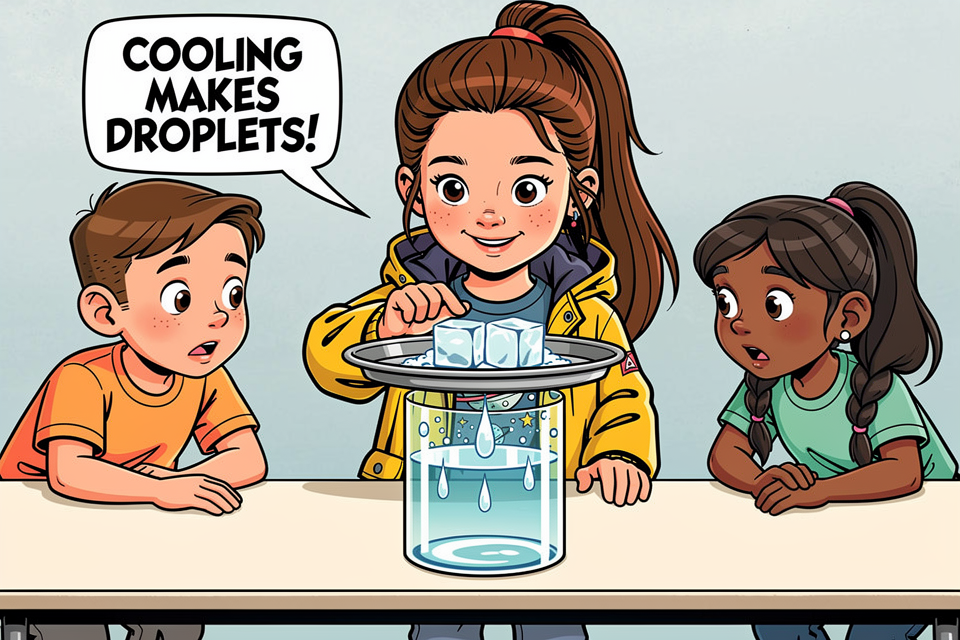

# EduComic

**Turn a lesson into a comic starring your class.**

[Public demo](https://bentheurich.github.io/EduComic/)



EduComic helps teachers turn lesson material into illustrated stories featuring a classroom's student-created characters. The project includes a complete local/private application and a separate, read-only public demo built from fictional data.

## What the public demo shows

- A teacher view with one fictional classroom, eight student avatars, two uploaded lesson materials, and two completed 12-panel comics.
- A student view for choosing a fictional profile, browsing the classroom, and reading the same story.
- A real PDF export assembled from the bundled comic panels.
- No uploads, writes, authentication claims, provider requests, or paid API calls.

The demo is deliberately read-only. Its banner identifies fictional data, and every screen runs entirely from bundled assets in the browser.

## How EduComic works

1. A teacher creates a classroom and uploads teaching material as text-based PDFs.
2. Students create profiles and optional photo-guided comic avatars.
3. OpenAI produces structured story ideas and a lesson-grounded script.
4. Black Forest Labs generates story previews, avatars, and comic panels.
5. The teacher reviews the story, can request a panel correction, and exports the finished comic as a PDF.

Paid generation is explicit and recoverable: completed panels are checkpointed, interrupted provider jobs resume without duplicate submission, moderated panels require a deliberate retry, and corrections remain candidates until the teacher accepts them.

## Public demo and local application

| | Public demo | Local/private application |
| --- | --- | --- |
| Data | Bundled fictional fixtures | SQLite and local files |
| Provider calls | None | Bring your own OpenAI and BFL keys |
| Changes | Read-only | Persistent on the local machine |
| Authentication | Fictional profile selection | Local profile selection, not authentication |
| Hosting | Static GitHub Pages build | Localhost-only FastAPI and Vite servers |

The local application is a prototype for private evaluation, not a hosted multi-tenant school service.

## Run locally

### Prerequisites

- Python 3.12 and [uv](https://docs.astral.sh/uv/)
- Node.js 24
- Optional OpenAI and Black Forest Labs keys for paid generation

Install and start the backend:

```bash
cd backend
uv sync --extra dev --locked
cp .env.example .env
uv run python src/run_local.py --reload
```

In another terminal, install and start the frontend:

```bash
cd frontend
npm ci
npm run dev
```

Open `http://127.0.0.1:8080/`. First startup creates `backend/data/`, applies the checked-in SQLite migrations, and serves managed media through the local API. Provider keys belong only in `backend/.env` and are never sent to the browser.

To preview the same static build used by GitHub Pages:

```bash
cd frontend
npm run build:demo
npm run preview:demo -- --host 127.0.0.1 --port 4173
```

## Verification

```bash
cd backend
uv run pytest -q

cd ../frontend
npm test -- --run
npm run lint
npm run typecheck
npm run build:demo
```

GitHub Actions runs the backend and frontend gates without provider credentials. The Pages workflow builds only the fictional demo and rejects artifacts containing known secret names or live OpenAI/BFL endpoints.

## Architecture

- React 18, TypeScript, and Vite provide the browser interface.
- FastAPI provides the local JSON and media API.
- SQLAlchemy and Alembic manage the local SQLite data contract.
- OpenAI provides structured story generation and optional panel review.
- Black Forest Labs FLUX models provide artwork.
- Generated and uploaded files are validated and copied into managed local storage before becoming readable application data.

## Current limitations

- Local teacher and student selection is not authentication; do not expose the FastAPI server to the Internet.
- The public demo contains one fictional classroom and two complete comics.
- Scanned PDFs are not supported because OCR is not included.
- Provider calls cost money. Automatic panel review is off by default, and paid retries are never automatic.
- Hosted authentication, authorization, tenant isolation, and school operations are future work.

## Team

- [Florian Schwieren](https://www.linkedin.com/in/florian-schwieren-618750215/)
- [Pouya Shekarchizadeh](https://www.linkedin.com/in/pooyash1998/)
- [Anastasia Koslova](https://www.linkedin.com/in/anastasia-koslova-a329091b7/)
- [Tim Gaydoul](https://www.linkedin.com/in/tim-gaydoul-048788174/)
- [Ben Theurich](https://www.linkedin.com/in/ben-theurich/)

EduComic uses FLUX by Black Forest Labs for artwork and OpenAI for story generation. The fictional public-demo media contains no real student data.

## License

EduComic is available under the [MIT License](LICENSE).
